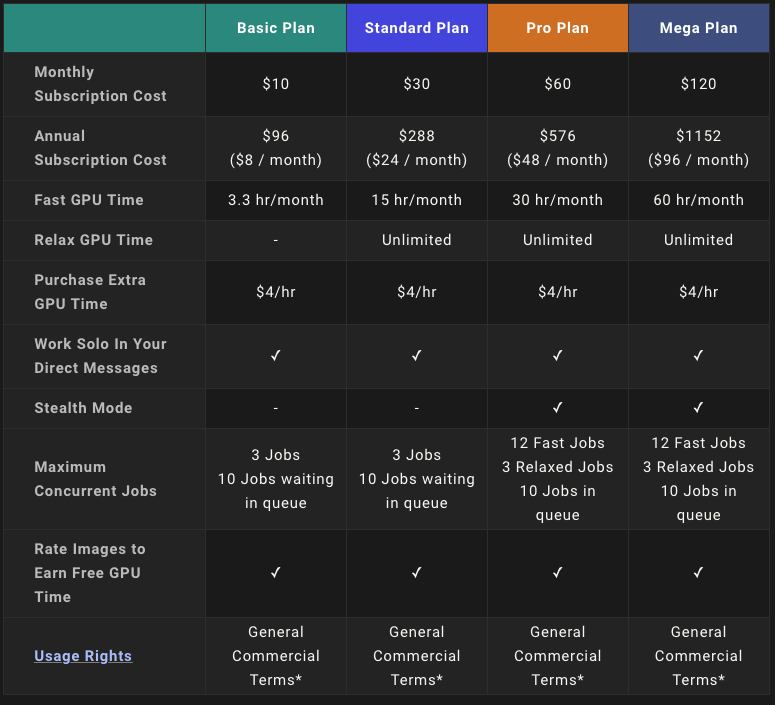

          # MidJourney Inc. AI company case study by Franck Nan

## Introduction

MidJourney inc. is an AI technology company specializing in the areas of generative AI for creating and enhaning visual content. THe company is known for its AI tools that assists designers, artists, and other creative professionals in generating high-quality images and artwork through deep learning algorithems.

[MidJourney](https://www.midjourney.com/home) was founded by [David Holz](https://www.linkedin.com/in/dsholtz/) in August 2021, with headquarters in San Francisco. David Holz describes MidJourney as an independent research lab that focuses on "exploring new mediums of thought and expanding the imaginative powers of the human species", with a mission to democratize creativity by leveraging AI to enable all users, regardless of their technical ability, to create unique visual content.  

Holz is a [self-described](https://www.theverge.com/2022/8/2/23287173/ai-image-generation-art-midjourney-multiverse-interview-david-holz)
 serial entrepreneur, having founded a technoclogy company called Leap Motion in 2011 and ran the business for 12 years. Holz decided to switch gear in 2021 and started MidJourney as a self-funded research lab with only 10 engineers to develop variety of exploratory projects and ultimately became known with their image generation tool that was launched in Sept 2022.

## Business Activities

### <u>Product</U>
MidJourney offers a range of products:
* flagship product is its AI image Generator which allows the users to create original images using text prompts in a Discord group chatbot. 
* Creative collaboation tools, which allow multiple users tocollaborate on AI-generated art proejct.
* API & SDK offerings, allowing developers with the ability to integrate MidJouney's generative AI capabilities into their own apps. 

### <u>Customer</U>
MidJourney serves a diverse clientele, including 
* Artists & designers using innovative tools to brainstorm and enhance their ideation processes
* Creative studios and agencies using AI to enhance their workflow and test ideas
* Advertisers to generate customized images that can be easily modified without having to pay for a stock photo license or photographer.
* Enterprises seeking to develop and reuse contents across different social platforms by making quick modification or edits.

### <u>Market</U>

The generative AI market size is large and fast growing. It was valued at just under $USD [45 billion](https://www.statista.com/forecasts/1449838/generative-ai-market-size-worldwide#:~:text=The%20generative%20AI%20market%20is,double%20the%20size%20of%202022.)
 at the end of 2023, nearly dobule the size of 2022. The annual growth of nearly $USD 20 billion is expected to continue till 2030. Within this the generative AI art market in particular was valued at USD212 million in 2022 and projected to be gorwing at an even faster rate at 40.5% CAGR, with a potential market size of $USD [5.8 billion](https://www.enterpriseappstoday.com/news/generative-ai-in-art-market-to-witness-positive-growth-at-40-5-cagr.html) by 2032.

### <u>Business Model</U>

Midjourney generates revenue through its [tiered subscription models](https://docs.midjourney.com/docs/plans), from a basic plan of $10 a month with limited hours of engagement and processing speed to to the most premium "mega" plan of $120 a month that offers additional features such as fast GPU time, concurrent jobs, and privacy control. 

s
## Competitive Landscape
MidJourney operates in the competitive landscape of generative AI and creative tools. Here are some of its key competitors:

1. Open AI([DALL-E2](https://openai.com/dall-e-2)): 

    perhaps MidJourney's biggest competitor, DALL-E2 is a powerful AI image generator by the well-funded Open AI, whose web app UI may be easier for consumers who are not already on Discord.  

2.  [Adobe Sensei](https://business.adobe.com/products/sensei/adobe-sensei-genai.html)

    Adobe sensei integratses AI into Adboe's creative suite - widely used by creative professionals across different fields. However the high cost of the app subscription may limit accessibility for some.

3. [DeepArt.io](https://creativitywith.ai/deepartio/)

    DeepArt.io specializes in style transfer, transforming photos into artworks. It is user-friendly but lacking in a wider range of functionality
4. [RunwayML](https://runwayml.com)

    RunwayML provides AI models suited for collaborative work, but the interface can be complex and potentially costly.

Despite strong competitors in the field, MidJourney remains at the forefront in the AI image generator space. Some of MidJourney's competitive edges include:
* **realistic image quality** - by using both a large language model an da diffusion model 
* **user-friendly interface** - straight-forward prompts designed for users of varying technical skills
* **community & collaboration** - Discord platform encourages users to share, learn and comment on each oher's work
* **continuing improvement in app development** - since the Beta launch in Sept 2022, MidJourney has launched 5 additional versions with significant improvement in image quality in each iteration

## Results
With about 17 millions people now using the tools, and 1 to 2 million active users, the company has projected $USD [300 million](https://www.fastcompany.com/91033497/midjourney-most-innovative-companies-2024) in annulaized revenue in 2023. As a privately-held company with no outside investors, there is little financial information avaialble to the public regarding the company.

## Personal experience & Recommendation
Having briefly experimented with MidJourey I was incredibly impressed by the quality of the images rendered in all types of styles with extremely nuanced details, as well as the speed with which the images were generated. MidJourney is an incredibly effective tool to aid in the ideation process, to test various options or to refine an idea through iterative versioning. 

Since the initial beta launch in Sept 2022, MidJourney has released 6 additional versions of its image generator. With each update the image quality continue to improve, and this continuing evolution and refinement of its product will keep MidJourney ahead of its competitors. I peronally would also love to see MidJourney delving into vidoe and animation generation as well. 

